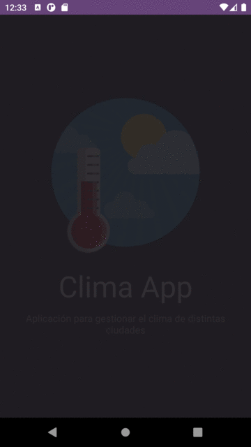

# Aplicación de Clima
Este proyecto es una aplicación que muestra datos climáticos de ciudades elegidas por el usuario, el usuario puede buscar y guardar ciudades para consultar luego el clima con un pronostico hasta 6 días.

# Prototyping y Persona Canvas
El prototipo fue realizado en Figma, no es necesario instalar el programa, se puede ver online desde el siguiente link [Ver Prototipo y Persona Canvas Online](https://www.figma.com/file/RbcUfuYrI8hzPMzERBanGT/weather-app-(Community)?node-id=0%3A1)

# Vista Previa Proyecto


# Requisitos
Antes de comenzar, necesitará las siguientes herramientas instaladas en su equipo: [Git](https://git-scm.com/) y [Node.js > v12](https://nodejs.org/en/).

También deberá configurar el entorno de desarrollo para una aplicación React Native: [Configuración de React Native Environment](https://reactnative.dev/docs/environment-setup). Y por supuesto tener un editor para trabajar con el código como [Visual Studio Code](https://code.visualstudio.com/)

# Ejecutando la App
```
# Clone este repositorio
git clone https://github.com/adriandesimone/AppReactNative

# Acceda a la carpeta del proyecto desde la terminal/cmd
cd AppReactNative

# Instale las dependencias
npm install
o si tiene el gestor de paquetes yarn puede utilizar:
yarn

# Si va a emular con Android, ejecute este comando
npm run android
o
yarn android

# Si desea emular con ios, ejecute este comando
npm run ios
o
yarn ios
```

# Herramientas
Se utilizaron las siguientes herramientas en la elaboracion del proyecto:

* [React Native](https://reactnative.dev/)
* [React Navigation](https://reactnavigation.org/)
* [OpenWeatherMap API](https://openweathermap.org/api)
* [React Native Vector Icons](https://github.com/oblador/react-native-vector-icons)
* [Momentjs](https://momentjs.com/)
* [Formik](https://formik.org/)
* [Yup](https://github.com/jquense/yup)
* [AsyncStorage](https://github.com/react-native-async-storage/async-storage)
* [Eslint](https://eslint.org/)
* [Prettier](https://prettier.io/)
* [Iconos OpenWeather](https://github.com/yuvraaaj/openweathermap-api-icons/tree/master/icons) y [IcoFinder](https://www.iconfinder.com)
